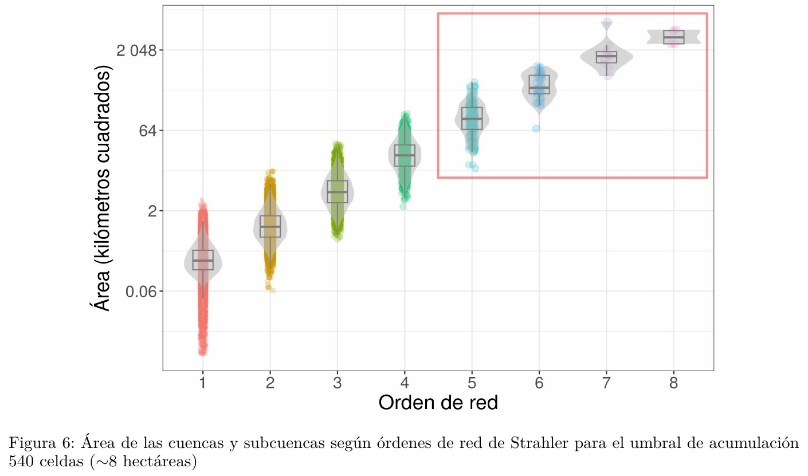

```{r setup, include=FALSE, echo=F}
knitr::opts_chunk$set(echo = FALSE)
ruta_figuras <- 'img/'
```

# JUSTIFICACIÓN

-   **Limitaciones de las fuentes sobre hidrografía**. La hidrografía de República Dominicana, crucial para una gestión eficiente del agua, no había sido elaborada de forma sistemática ni a resolución suficiente.

-   **Ventajas del DEM ALOS PALSAR RTC**. Con 12.5 metros de resolución espacial, se obtiene una red hidrográfica más detallada y precisa, especialmente en zonas montañosas.

-   **Necesidad de una metodología reproducible basada en código abierto**. Esto facilita el uso y aplicación del estudio por parte de la comunidad científica y académica, **con especial interés en estudiantes como público meta**.

## 

|                                 |                                 |
|:-------------------------------:|:-------------------------------:|
|  |  |

## 

|                                              |                                 |
|:--------------------------------------------------:|:------------------:|
| {width="80%"} |  |

## 

## 

## 

|                                                  |                             |
|:--------------------------------------------------:|:------------------:|
| {width="100%"} |  |

## 

|                                    |                              |
|:----------------------------------:|:----------------------------:|
|  |  |

# MATERIALES Y MÉTODOS

```{bash, eval=F, include=F, echo=F}
ln -s ../../preprint_files/figure-latex/mapaindice-1.pdf img/
convert -density 300 -background white -alpha remove -alpha off -resize 1920x \
  img/mapaindice-1.pdf \
  img/mapaindice-1.jpg
```

## 

## 

```{bash, eval=F, include=F, echo=F}
ln -s ../../figuras/resumen-obtencion-preprocesamiento-dem.pdf img/
convert -density 300 -background white -alpha remove -alpha off -resize 1920x \
  img/resumen-obtencion-preprocesamiento-dem.pdf \
  img/resumen-obtencion-preprocesamiento-dem.jpg
```

## 

```{bash, eval=F, include=F, echo=F}
ln -s ../../figuras/resumen-procesamiento-hidrologia-computacional.pdf img/
convert -density 300 -background white -alpha remove -alpha off -resize 1920x \
  img/resumen-procesamiento-hidrologia-computacional.pdf \
  img/resumen-procesamiento-hidrologia-computacional.jpg
```

## 

## 

## DEM relleno y suavizado

|                Relleno                 |                Suavizado                 |
|:----------------------------------:|:----------------------------------:|
| {width="100%"} | {width="100%"} |

## {width="100%"}

## {width="100%"}

## Red de cursos para tallado


## DEM tallado (grabado) y sin tallar

{width="75%"}

## 

## 

## 

## Umbral de acumulación


## Tres umbrales de acumulación (180, 540 y 900 celdas \~2, 8 y 14 ha)


## 

# RESULTADOS

## 

## 

|                                                    |
|:--------------------------------------------------:|
| {width="75%"}  |
| {width="75%"} |

## 

|                                                                            |
|:----------------------------------------------------------------------:|
|           {width="75%"}           |
| {width="65%"} |

## 

## 

## 

## 

## 

## 

## 

## {width="75%"}

## 

# DISCUSIÓN

## 

-   **Representación detallada de cuencas y redes de drenaje** en República Dominicana, utilizando DEM de ALOS PALSAR RTC y técnicas avanzadas de hidrología computacional.

-   **Avance significativo en la delimitación de cuencas y extracción de redes** (e.g. respecto de MTN y OSM), especialmente en áreas montañosas, que permitirá realizar otros estudios de hidrología computacional.

-   **Datos abiertos y protocolos reproducibles** disponibles en repositorio público, en un contexto de limitada disponibilidad de datos detallados para hidrología computacional.

## 

-   La red de drenaje refleja la **influencia de factores geomorfológico y litológicos**, como la permeabilidad de las rocas y las características topográficas.

-   **Importancia de los sistemas kársticos** en la estructuración de la red hidrográfica, con especial atención al karst de Los Haitises.

-   La **reorganización del drenaje** a lo largo del tiempo es destacada, y se atribuye a factores geotectónicos, litológicos y climáticos.

## 

-   Se confirma la **relación exponencial** entre el orden de red y variables morfométricas, con singularidades en los órdenes altos.

-   Una **limitación destacada del trabajo es la baja precisión posicional** de la red en áreas de llanura, que estudios posteriores podrían contribuir a mejorar.

-   Los **resultados del estudio tienen potencial de impactar en la investigación hidrológica dominicana**, con aplicaciones en conservación, modelización hidrológica y biodiversidad; contribución a la educación con la publicación de código y protocolos reproducibles.

# REFERENCIAS

<section style="font-size: 24px; text-align: left;">

</section>
